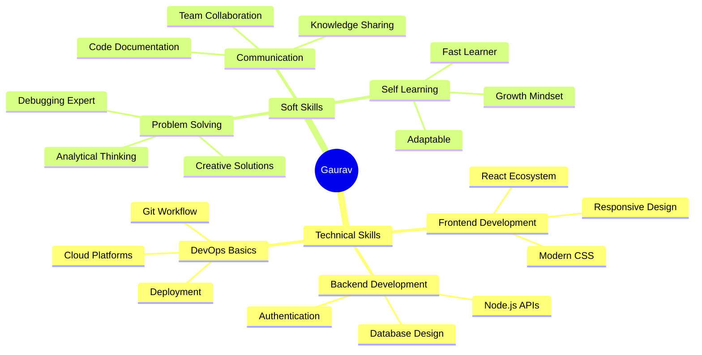

<div align="center">

# 👨‍💻 Gaurav | Full-Stack Developer in the Making


<p align="center">
  <a href="mailto:gauravramyadav@gmail.com"></a>
  <a href="https://linkedin.com/in/gurvv"></a>
  <a href="https://github.com/archduke1337"></a>
  
</p>

</div>

---

## 🎯 About Me


```typescript
const gaurav = {
    role: "Full-Stack Developer & Student",
    location: "Pune, Maharashtra, India 🇮🇳",
    education: "BCA @ ADYPU",
    passions: ["Web Development", "Cybersecurity", "Open Source"],
    currentlyBuilding: "Innovative solutions that matter",
    lifePhilosophy: "Code with purpose, learn with curiosity",
    superPower: "Turning caffeine into functional code ☕️"
};
```

### 🌟 Quick Highlights

- 🎓 **Computer Science Enthusiast** | Pursuing BCA at ADYPU, Pune
- 💼 **Full-Stack Developer** | Specializing in Modern Web Technologies
- 🔒 **Cybersecurity Explorer** | Understanding security from the ground up
- 🚀 **Innovation Driver** | Building projects that solve real problems
- 🌱 **Lifelong Learner** | Currently diving deep into Cloud & DevOps
- 🤝 **Collaboration Ready** | Open to exciting project opportunities

---

## 🛠️ Technology Stack

<div align="center">

### 💻 Core Technologies


### 🗄️ Databases & Backend


### 🛠️ Developer Tools


### 📚 Currently Mastering


</div>

---

## 🚀 Featured Projects

<div align="center">

<table>
<tr>
<td width="50%">

### 🔍 [SeekEngine](https://github.com/archduke1337/SeekEngine)
**Advanced Search Engine Implementation**
- Built with modern web technologies
- Optimized search algorithms
- Clean, intuitive UI/UX


</td>
<td width="50%">

### 🤖 [Gil](https://github.com/archduke1337/Gil)
**Intelligent Automation Tool**
- Smart task automation
- User-friendly interface
- Extensible architecture


</td>
</tr>
<tr>
<td width="50%">

### 🏠 [Ro0m](https://github.com/archduke1337/Ro0m)
**Collaborative Space Platform**
- Real-time collaboration features
- Secure user authentication
- Responsive design


</td>
<td width="50%">

### 🎯 More Projects Coming Soon!
**Currently building innovative solutions**
- Full-stack applications
- Open-source contributions
- Learning projects


</td>
</tr>
</table>

</div>

---

## 📊 GitHub Statistics

<div align="center">


</div>

<div align="center">

[](https://github.com/ryo-ma/github-profile-trophy)

</div>

---

## 🎯 2025 Goals & Roadmap

<div align="center">

| 🎓 Learning | 🚀 Building | 🤝 Contributing | 💼 Professional |
|:---:|:---:|:---:|:---:|
| Next.js & Server Components | Full-Stack SaaS Platform | 10+ Open Source PRs | Portfolio Website |
| AWS Cloud Architecture | AI-Powered Web App | Developer Community | Freelance Projects |
| Docker & Kubernetes | E-commerce Solution | Technical Blog Posts | Internship Ready |
| Advanced TypeScript | Real-time Chat App | Code Reviews & Mentoring | Professional Network |

</div>

### 📈 Current Focus Areas
```javascript
const developmentJourney = {
    immediate: {
        tech: ["Next.js", "TypeScript", "Tailwind CSS"],
        projects: ["Portfolio 2.0", "SaaS Boilerplate"],
        learning: "System Design & Cloud Architecture"
    },
    shortTerm: {
        goals: ["AWS Certification", "100+ GitHub Contributions"],
        skills: ["Docker", "CI/CD", "Testing"],
        collaboration: "Open Source Projects & Hackathons"
    },
    longTerm: {
        vision: "Full-Stack Engineer at a Product Company",
        mastery: ["Microservices", "DevOps", "Scalable Systems"],
        impact: "Building products that reach millions"
    }
};
```

---

## 🏆 Achievements & Milestones

<div align="center">

| 🎯 Achievement | 📅 Year | 🌟 Highlight |
|:---|:---:|:---|
| 🚀 Started Developer Journey | 2023 | Built first web application |
| 💻 ADYPU BCA Program | 2024 | Specializing in Web Technologies |
| 🌐 Open Source Contributor | 2024 | Contributing to community projects |
| 📚 100+ GitHub Repositories | 2024 | Continuous learning & building |
| 🎓 Advanced JavaScript | 2024 | Mastered modern ES6+ features |

</div>

---

## 💡 What I Bring to the Table

<div align="center">


</div>

---

## 📝 Latest Activity

<!--START_SECTION:activity-->
<!-- This section will be automatically updated by GitHub Actions -->
<!--END_SECTION:activity-->

---

## 💭 Developer Philosophy

<div align="center">

> "First, solve the problem. Then, write the code." 
> 
> — John Johnson


</div>

### 🎯 My Approach to Development

- **🧠 Think First, Code Later** | Understanding the problem is half the solution
- **📖 Documentation Matters** | Code is read more than written
- **🧪 Test Everything** | Confidence comes from comprehensive testing
- **♻️ Refactor Regularly** | Clean code is happy code
- **🤝 Collaborate & Learn** | The best developers never stop learning
- **🎨 User-Centric Design** | Technology serves people, not the other way around

---

## 🤝 Let's Build Something Amazing Together!

<div align="center">

### 💼 Open for Opportunities

I'm actively seeking opportunities to collaborate on innovative projects, contribute to open-source, and connect with fellow developers. Whether it's a startup idea, an open-source project, or just a tech discussion — I'm all ears!

### 📬 Get in Touch

<table>
<tr>
<td align="center" width="33%">
<a href="mailto:gauravramyadav@gmail.com">

<br/>Professional Inquiries
</a>
</td>
<td align="center" width="33%">
<a href="https://linkedin.com/in/gurvv">

<br/>Professional Network
</a>
</td>
<td align="center" width="33%">
<a href="https://github.com/archduke1337">

<br/>Check My Work
</a>
</td>
</tr>
</table>

</div>

---

<div align="center">

### 🎨 "Code. Create. Innovate. Repeat."


**⚡ Powered by passion, driven by purpose, fueled by coffee ☕️**

*Thanks for stopping by! Let's create something extraordinary together! 🚀*

<sub>💡 Profile README powered by Markdown magic and developer dedication</sub>

</div>
